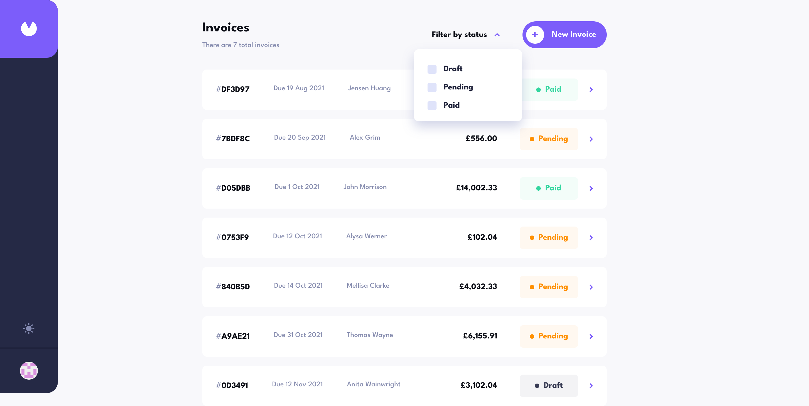

# Frontend Mentor - Invoice app solution

## Table of contents

- [Overview](#overview)
  - [The challenge](#the-challenge)
  - [Screenshot](#screenshot)
  - [Links](#links)
- [My process](#my-process)
  - [Built with](#built-with)
  - [What I learned](#what-i-learned)
  - [Continued development](#continued-development)
  - [Useful resources](#useful-resources)
- [Author](#author)

**Note: Delete this note and update the table of contents based on what sections you keep.**

## Overview

### The challenge

Users should be able to:

- View the optimal layout for the app depending on their device's screen size
- See hover states for all interactive elements on the page
- Create, read, update, and delete invoices
- Receive form validations when trying to create/edit an invoice
- Save draft invoices, and mark pending invoices as paid
- Filter invoices by status (draft/pending/paid)
- Toggle light and dark mode

### Screenshot

### Links

- Solution URL: [https://github.com/12Ricky0/invoice-app.git](https://github.com/12Ricky0/invoice-app.git)
- Live Site URL: [https://invoice-app-rosy-six.vercel.app/](https://invoice-app-rosy-six.vercel.app/)

## My process

### Built with

- Semantic HTML5 markup
- CSS custom properties
- PostgreSQL
- [NextAuth](https://authjs.dev/) - Authentication
- [Next.js](https://nextjs.org/) - React framework
- [Tailwind](https://tailwindui.com/) - For styles

### What I learned

This was my first time using the NextJs Library (besides React) and NextAuth, so I learned a lot! Besides learning this new framework/Library, I realized how important it is to stay organized and write code that is clean and reusable, especially as the project you're working on grows larger. 🙂

On that note—I was kind of lost when it came to structuring and organizing a larger project like this, so I don't know how clean or reusable my code is and I might have come up with my own way of doing things here and there. 😥 I'd like to improve, however, so any feedback is welcome! 👍

### Continued development

There's a quick flash of light mode that appears before the page transitions to dark mode when the page loads if the theme stored in local storage is dark mode. This is because of Next.js's pre-rendering feature and I haven't worked on a solution for that yet.

## Author

- Frontend Mentor - [@12Ricky0](https://www.frontendmentor.io/profile/12Ricky0)
- Instagram - [@temple4b](https://www.instagram.com/temple4b)
